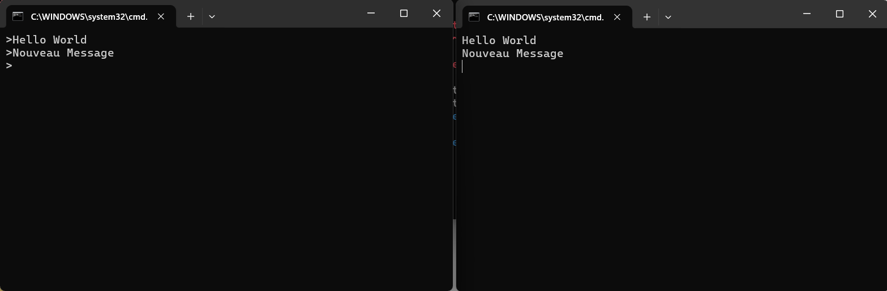

<h1 align="center" > Event-Driven Architecture avec Kafka </h1>

Ce projet illustre l'intégration de Kafka avec Spring Cloud Streams pour bâtir une architecture réactive et scalable.

<h2>Configuration et test de Kafka :</h2>

<h3>1. Installation de Kafka.</h3>

<h3>2. Démarrage de Zookeeper et Kafka Broker.</h3>
<h4>Commandes: </h4>
<pre>
<code>
start bin\windows\zookeeper-server-start.bat config/zookeeper.properties
start bin\windows\kafka-server-start.bat config/server.properties
</code>
</pre>

<h3>3. Tests avec kafka-console-producer et kafka-console-consumer.</h3>
<h4>Commandes: </h4>
<code>
Start-Process "bin\windows\kafka-console-consumer.bat" -ArgumentList "--bootstrap-server", "localhost:9092", "--topic", "R1"
Start-Process "bin\windows\kafka-console-producer.bat" -ArgumentList "--broker-list localhost:9092 --topic R1"
</code>

  
  

<h2>Développement des services Kafka :</h2>

<h3>1. Producer Kafka : Service REST permettant de produire des événements.</h3>

<h3>2. Consumer Kafka : Service consommant les messages produits.</h3>

<h3>3. Supplier Kafka : Génération automatique d'événements.</h3>

<h3>4. Stream Processing avec Kafka Streams : Service d'analyse de données en temps réel.</h3>

<h2>Application Web temps réel :</h2>

Interface permettant d'afficher les résultats des analyses de flux de données en temps réel.

  
  

